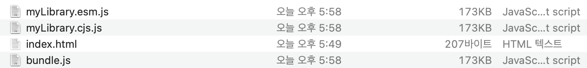
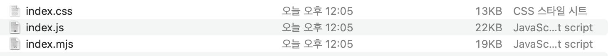
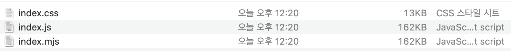
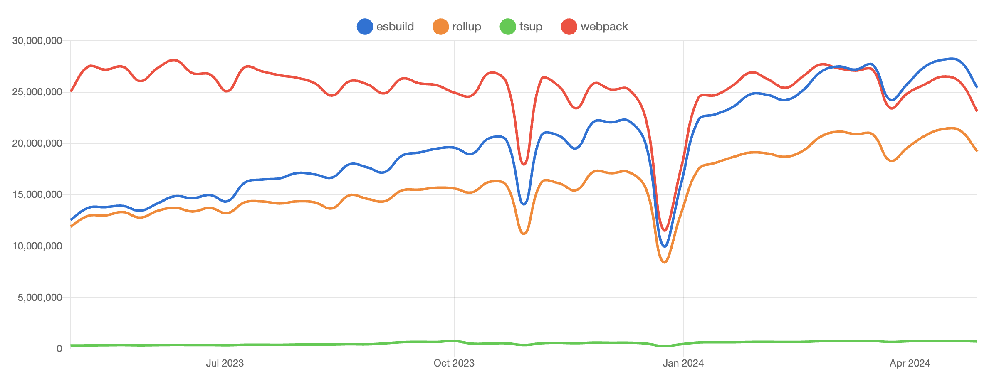

## 리액트 번들링 비교

### 명령어

테스트하고 싶은 번들러 프로젝트를 기본 셋업하고 다음과 같이 테스트 파일을 생성하고 빌드한다.

```shell
node generateCodes.js (생성할 폴더)
node generateApp.js (생성할 폴더)

npm run build
```

### 조건

#### 파일

- index.html
- src/index.tsx
- src/App.tsx

100개의 Button.tsx
100개의 Button.css
1개의 utils.ts (100개의 함수가 선언돼있고, 랜덤하게 Button 컴포넌트에서 특정 함수를 1개만 사용한다. 나머지 함수는 트리쉐이킹돼야 한다)
App.tsx에서 100개의 Button.tsx를 모두 사용한다.

#### dependencies

- react
- react-dom

## 결과

### 웹팩


main.js 파일의 사이즈가 207KB가 나왔다.

웹팩의 로더는 ts-loader를 사용해서 jsx 문법을 js로 변환하였고, webpack5의 기본 설정인 @babel/preset-env를 사용해 기본적인 트랜스파일이 되도록 하였다.

### esbuild


bundle.js 파일의 사이즈가 162KB이다. bundle.css 파일이 분리돼 합치면 175KB로 webpack보다 32KB정도 사이즈가 작아졌다.

단, minify 옵션들 true로 설정하여 코드 압축을 진행하였다.

### rollup



rollup은 esm, cjs, iife 등으로 빌드할 수 있어 3가지 방식으로 빌드해보았다.
결과적으로 173KB으로 모두 같은 용량을 갖고 있는 것을 확인할 수 있었다.

> external: ["react", "react-dom"] external 옵션을 추가하면 외부 패키지를 빌드에서 제외할 수 있다.
> 지금 빌드 결과엔 적용하지 않았음.

단, rollup을 최적화하기 위해 rollup-plugin-terser 플러그인을 사용해서 minify 하였다.

### tsup



별도의 세팅을 하지 않았는데, 온전히 내 소스코드만 빌드하였다.
js로 보면 22kb, mjs로 보면 19kb의 용량을 갖고 있다.


noExternal 플래그를 설정해서 react와 react-dom을 포함했을 때 162KB로 빌드되고, css를 합치면 175KB로 esbuild의 결과와 똑같다.

> Bundle your TypeScript library with no config, powered by esbuild.

tsup이 esbuild를 사용하고 있어서 이런 결과가 나온 것 같다.

## 결과 이외의 것들

번들러가 단순히 번들만 잘한다고해서 디자인 시스템에 사용할 수 있지 않기 때문에 어떤 번들러가 어떤 기능을 잘 수행하는지 확인해야 한다.

### rollup

rollup은 자체적인 번들링 과정을 거친다. (go로 만들어진 esbuild에 비하면 느리다)
하지만 다음과 같은 차별점을 가진다

#### es6 컴파일

webpack같은 경우에는 빌드되면 무조건 cjs로 빌드되지만, rollup은 es6로 컴파일할 수 있다.
따라서, 라이브러리 사용자들에게 es6 형태의 코드를 제공할 수 있는 장점이 있다.

#### 이외의 장점

- browser, node에서 각각 다르게 설정하여 빌드가 가능하다.
- 트리쉐이킹과 code splitting이 가능하다.
- Vite에서 rollup을 사용한다. (개발 서버는 esbuild, 최종 번들링은 rollup을 사용한다. esbuild로 소스코드맵을 만들어서 rollup에서 빌드할 때 속도를 향상시킨다. )

### tsup

tsup의 빌드 결과는 esbuild를 기반으로 하기 때문에 번들링 크기가 동일하게 나왔다.
tsup은 어떤 점에서 esbuild와 다를까? tsup에서 지향하는 것은 다음과 같다.

#### ts를 js로 컴파일 하는 경우

타입스크립트를 사용하는 경우 타이핑에 따라 컴파일이 되어 자바스크립트 파일이 생긴다.
하지만 단순히 컴파일만 하고 minify를 해주는 과정이 없기 때문에 컴파일된 자바스크립트의 사이즈가 컴팩트하지 않다.

#### node에서의 동작

node 환경에서의 타입스크립트는 cjs, esm를 지원하는데 cjs to cjs, esm to esm은 되지만, cjs to esm을 하려면 다른 방법을 시도해봐야 한다. (개발 환경이 cjs인 경우에 esm을 사용하는 유저들에게 라이브러리를 제공할 수 없다)

#### tsup에서의 장점

위에서 말한 단점을 tsup은 해결하고 있다.

- ts to js로 컴파일 할 때, esbuild를 사용해서 minify할 수 있다.
- cjs, esm간의 컴파일을 지원한다
- type file을 추출할 수 있다.

tsup은 위와 같은 기능들을 갖추고 있어 라이브러리를 개발하기 위한 요소를 충분히 갖춘 번들러인 것 같다.

### 점유율



현재 시점 기준 점유율 순위가 놀랍다.

1. esbuild
2. webpack
3. rollup
4. tsup

esbuild가 1위를 하고 있는데, 여러 파생된 빌더 도구들이 esbuild를 사용하기 때문인 것 같다.
