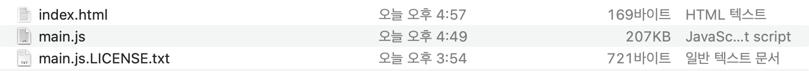
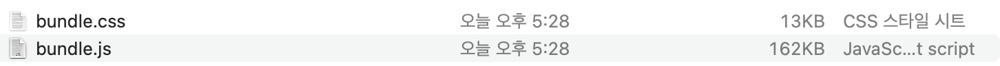

## 리액트 번들링 비교

### 명령어

테스트하고 싶은 번들러 프로젝트를 기본 셋업하고 다음과 같이 테스트 파일을 생성하고 빌드한다.

```shell
node generateCodes.js (생성할 폴더)
node generateApp.js (생성할 폴더)

npm run build
```

### 조건

#### 파일

- index.html
- src/index.tsx
- src/App.tsx

100개의 Button.tsx
100개의 Button.css
1개의 utils.ts (100개의 함수가 선언돼있고, 랜덤하게 Button 컴포넌트에서 특정 함수를 1개만 사용한다. 나머지 함수는 트리쉐이킹돼야 한다)
App.tsx에서 100개의 Button.tsx를 모두 사용한다.

#### dependencies

- react
- react-dom

## 결과

### 웹팩


main.js 파일의 사이즈가 207KB가 나왔다.

웹팩의 로더는 ts-loader를 사용해서 jsx 문법을 js로 변환하였고, webpack5의 기본 설정인 @babel/preset-env를 사용해 기본적인 트랜스파일이 되도록 하였다.

### esbuild


bundle.js 파일의 사이즈가 162KB이다. bundle.css 파일이 분리돼 합치면 175KB로 webpack보다 32KB정도 사이즈가 작아졌다.

단, minify 옵션들 true로 설정하여 코드 압축을 진행하였다.
